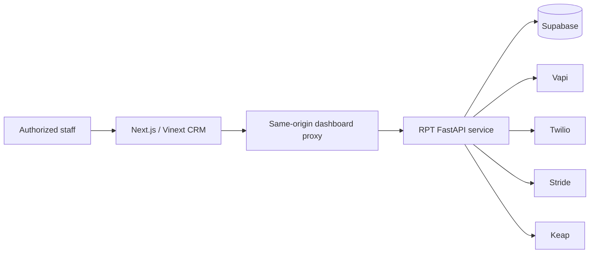

# Rausch Outreach CRM

An internal operations dashboard for Rausch Physical Therapy & Wellness. The frontend gives authorized staff
one place to create leads, monitor outreach cadences, review provider outcomes, manage appointments, and view
operational analytics.

> This repository contains the frontend only. It requires the companion RPT FastAPI service for data and
> provider actions.

## What it includes

- Database-backed lead intake with physical therapy and wellness classifications
- List and Kanban pipeline views with location, owner, stage, and search filters
- Live cadence progress, next-action state, conversations, calls, appointments, and activity history
- Review queue for uncertain provider results
- Appointment availability and scheduling controls
- Analytics, cadence templates, SMS templates, and provider-health administration
- Responsive desktop, tablet, and mobile layouts

## Architecture



Database and provider credentials stay in the backend. The browser communicates only with the same-origin
`/api/dashboard/*` proxy, which injects the dashboard credential on the server and permits a bounded set of
backend operations.

## Tech stack

- Next.js 16, React 19, and TypeScript
- Vinext and Vite
- Cloudflare Workers / OpenAI Sites-compatible output
- ESLint 9

## Run locally

Requirements: Node.js 22.13 or newer and the RPT backend running at `http://localhost:8000`.

```powershell
Copy-Item .env.example .env
npm ci
npm run dev
```

Set the same strong `DASHBOARD_API_TOKEN` in the frontend and backend `.env` files, then open
`http://localhost:3000`.

## Environment

| Variable | Purpose |
| --- | --- |
| `DASHBOARD_API_ORIGIN` | Base URL of the RPT backend; production requires HTTPS. |
| `DASHBOARD_API_TOKEN` | Server-to-server dashboard credential. Never expose it with a `NEXT_PUBLIC_` prefix. |
| `DASHBOARD_ALLOWED_EMAILS` | Comma-separated organization email allowlist used in production. |
| `DASHBOARD_ALLOW_LOCAL_DEMO` | Local-only authentication bypass. It does not enable fixture or showcase leads. |

Only `.env.example` is versioned. Real credentials belong in ignored local environment files or the hosting
platform's secret manager.

## Routes

| Area | Routes |
| --- | --- |
| Operations | `/`, `/leads`, `/appointments`, `/reviews`, `/analytics` |
| Administration | `/admin/cadence`, `/admin/templates`, `/admin/providers` |
| Lead workspace | `/leads/{leadId}` plus `/sms`, `/calls`, `/cadence`, `/appointments`, and `/history` |

Lead lists and workspaces render only records returned by the dashboard API. They refresh every five seconds
so worker and provider updates appear without a manual reload. Call artifacts are text-only; the CRM does not
store or expose call recordings.

## Quality checks

```powershell
npm run lint
npm run build
npm audit
```

## Production checklist

- Use a stable public HTTPS backend URL.
- Configure matching high-entropy dashboard tokens in both runtimes.
- Set the real organization staff email allowlist.
- Keep the CRM owner-only or restricted to approved organization users.
- Confirm backend worker, database migrations, provider webhooks, and readiness checks before enabling live
  outreach.
