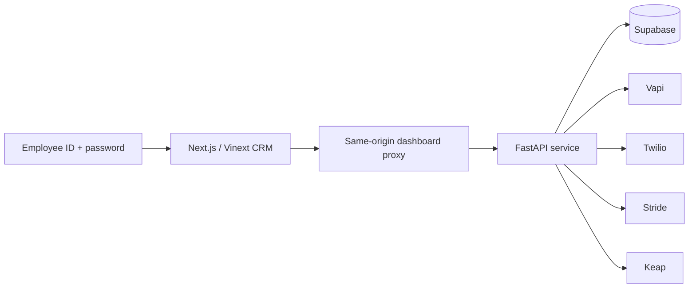

# Outreach Operations CRM

An internal operations dashboard for a healthcare outreach workflow. The frontend gives authorized staff one
place to create leads, monitor outreach cadences, review provider outcomes, manage appointments, and view
operational analytics.

<p>
  
  
  
  
</p>

> This repository contains the frontend only. It requires the companion FastAPI service for data and
> provider actions.

## What it includes

- Database-backed lead intake with physical therapy and wellness classifications
- List and Kanban pipeline views with location, owner, stage, and search filters
- Live cadence progress, next-action state, conversations, calls, appointments, and attributed activity
- Simple employee ID/password sign-in with super-admin permissions
- Review queue for uncertain provider results
- Appointment availability and scheduling controls
- Analytics, cadence templates, SMS templates, and provider-health administration
- Responsive desktop, tablet, and mobile layouts

## Architecture


```mermaid
flowchart LR
    Staff[Employee ID + password] --> UI[Next.js / Vinext CRM]
    UI --> Proxy[Same-origin dashboard proxy]
    Proxy --> API[FastAPI service]
    API --> DB[(Supabase)]
    API --> Vapi[Vapi]
    API --> Twilio[Twilio]
    API --> Stride[Stride]
    API --> Keap[Keap]
```

Database and provider credentials stay in the backend. The browser communicates only with the same-origin
`/api/dashboard/*` proxy. The proxy validates the signed employee session, then injects the server-only
dashboard credential and that employee's ID, name, and role. FastAPI repeats every role check.

## Tech stack

- Next.js 16, React 19, and TypeScript
- Vinext and Vite
- Native Next.js output for Vercel plus Vinext output for Cloudflare Workers / OpenAI Sites
- ESLint 9

## Run locally

Requirements: Node.js 22.13 or newer, `uv`, and the configured companion backend in the sibling
`aws_deployed_raush_pt_stride_keap` folder. Keep existing environment files; do not overwrite them.

```powershell
npm ci
npm run start:local
```

Set the same strong `DASHBOARD_API_TOKEN` in the frontend and backend `.env` files, then open
`http://localhost:3000` and sign in with an ID or configured email and password from `DASHBOARD_USERS_JSON`.

The Windows launcher starts the frontend and dashboard API together, reuses running services, and checks
both URLs. It does not run migrations, start outreach/Sheet workers, or enable live booking. Both services
remain running after the command exits. For frontend-only development, use `npm run dev` with the API
already running. For a fresh installation, copy `.env.example` to `.env` once and configure its secrets.

## Environment

| Variable | Purpose |
| --- | --- |
| `DASHBOARD_API_ORIGIN` | Base URL of the companion backend; production requires HTTPS. |
| `DASHBOARD_API_TOKEN` | Server-to-server dashboard credential. Never expose it with a `NEXT_PUBLIC_` prefix. |
| `DASHBOARD_USERS_JSON` | Server-only JSON roster. Requires exactly one `super_admin`; IDs and optional email logins must be unique and passwords at least 12 characters. |
| `DASHBOARD_SESSION_SECRET` | At least 32 random characters used to sign 12-hour HttpOnly login cookies. |

Only `.env.example` is versioned. Real credentials belong in ignored local environment files or the hosting
platform's secret manager.

Each roster entry has `id`, `name`, `password`, and `role`, plus an optional `email`. Email is a login alias;
the stable short ID is used for lead ownership and audit attribution. `DASHBOARD_ALLOWED_EMAILS` and
`DASHBOARD_STAFF_PASSWORD` are replaced by this per-user roster.

## Routes

| Area | Routes |
| --- | --- |
| Operations | `/`, `/leads`, `/appointments`, `/review`, `/analytics` |
| Administration | `/administration`, `/administration/cadence`, `/administration/templates` |
| Lead workspace | `/leads/{leadId}` plus conversations, cadence, appointments, and `/activity` (`/history` remains an alias) |

Lead lists and workspaces render only records returned by the dashboard API. They refresh every 20 seconds
so worker and provider updates appear without a manual reload. Call artifacts are text-only; the CRM does not
store or expose call recordings.

The lead's Activity tab shows **Team activity**: only staff-made changes, such as lead creation,
stage changes, and cadence pauses or resumes, attributed by name and date. It has no category filters;
automated events remain available in the other lead tabs. Overview has no duplicate activity panel.

New leads are always owned by the signed-in user; there is no owner selector or lead-edit dialog.
Cadence Studio manages global versions only. Step names automatically use their current day followed
by the action description, including after reordering. Personalized outreach controls and endpoints
have been removed; historical runs remain readable.

## Quality checks

```powershell
npm run lint
npx next typegen
npm run typecheck
npm run test:display
npm run test:cadence
npm run test:auth
npm run test:dashboard
npm run build
npm run build:vercel
npm audit
```

`npm run build` produces the Vinext/Sites bundle. `npm run build:vercel` produces the native `.next` bundle
expected by Vercel; the checked-in `vercel.json` selects that command automatically.

Vercel Authentication may remain as an outer deployment boundary. Application identity and activity
attribution come from the server-only roster. Change the roster in the host environment and redeploy to add,
remove, or update a user; no account-management screen is exposed.

## Production checklist

- Use a stable public HTTPS backend URL.
- Configure matching high-entropy dashboard tokens in both runtimes.
- Apply backend migration 031.
- Configure `DASHBOARD_USERS_JSON` with exactly one super admin and set a high-entropy `DASHBOARD_SESSION_SECRET`.
- Test one super-admin and one employee login after deployment.
- Keep the CRM owner-only or restricted to approved organization users.
- For Vercel, enable Vercel Authentication for **All Deployments** and restrict project access to organization
  staff. For Sites, retain the explicit organization email allowlist.
- Confirm backend worker, database migrations, provider webhooks, and readiness checks before enabling live
  outreach.
